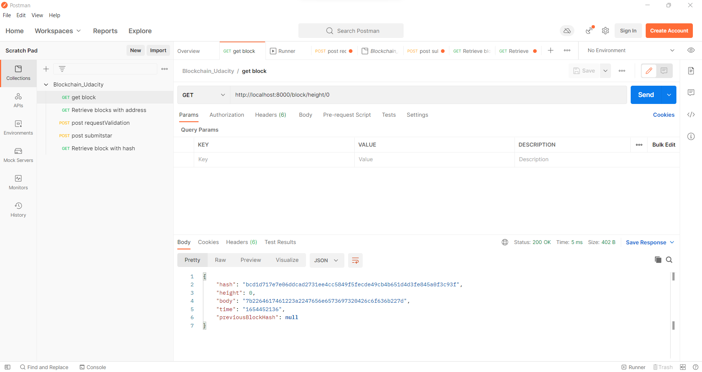

# Create Your Own Private Blockchain 
Author: chungnx
## Install library and run application
```bash
sudo apt install nodejs
sudo apt install npm
cd private_blockchain
npm install .
node app.js
```
[Postman api file](PostmanAPi.json)
## Screenshot result:


GET: http://localhost:8000/block/height/0


POST: http://localhost:8000/requestValidation


Sign Message:


POST: http://localhost:8000/submitstar


GET: http://localhost:8000/blocks/mhJjL6eR2HL5PrSmAjSZ2ze8pCNviV5J6U


GET: http://localhost:8000/blocks/mhJjL6eR2HL5PrSmAjSZ2ze8pCNviV5J6U


