# Supply chain & data auditing

This repository containts an Ethereum DApp that demonstrates a Supply Chain flow between a Seller and Buyer. The user story is similar to any commonly used supply chain process. A Seller can add items to the inventory system stored in the blockchain. A Buyer can purchase such items from the inventory system. Additionally a Seller can mark an item as Shipped, and similarly a Buyer can mark an item as Received.

## Flow chart 
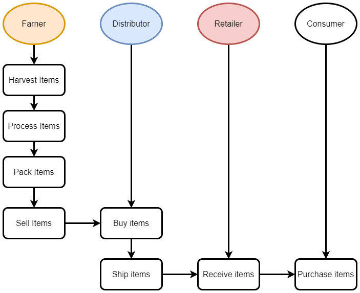

## Getting Started

These instructions will get you a copy of the project up and running on your local machine for development and testing purposes. See deployment for notes on how to deploy the project on a live system.

### Prerequisites

Please make sure you've already installed ganache-cli, Truffle and enabled MetaMask extension in your browser.

```
Give examples (to be clarified)
```

### Installing

> The starter code is written for **Solidity v0.4.24**. At the time of writing, the current Truffle v5 comes with Solidity v0.5 that requires function *mutability* and *visibility* to be specified (please refer to Solidity [documentation](https://docs.soliditylang.org/en/v0.5.0/050-breaking-changes.html) for more details). To use this starter code, please run `npm i -g truffle@4.1.14` to install Truffle v4 with Solidity v0.4.24. 

A step by step series of examples that tell you have to get a development env running

Clone this repository:

```
git clone https://github.com/udacity/nd1309/tree/master/course-5/project-6
```

Change directory to ```project-6``` folder and install all requisite npm packages (as listed in ```package.json```):

```
cd project-6
npm install
```

Launch Ganache:

```
ganache-cli -m "spirit supply whale amount human item harsh scare congress discover talent hamster"
```

Your terminal should look something like this:


In a separate terminal window, Compile smart contracts:

```
truffle compile
```

Your terminal should look something like this:


This will create the smart contract artifacts in folder ```build\contracts```.

Migrate smart contracts to the locally running blockchain, ganache-cli:

```
truffle migrate
```

Your terminal should look something like this:

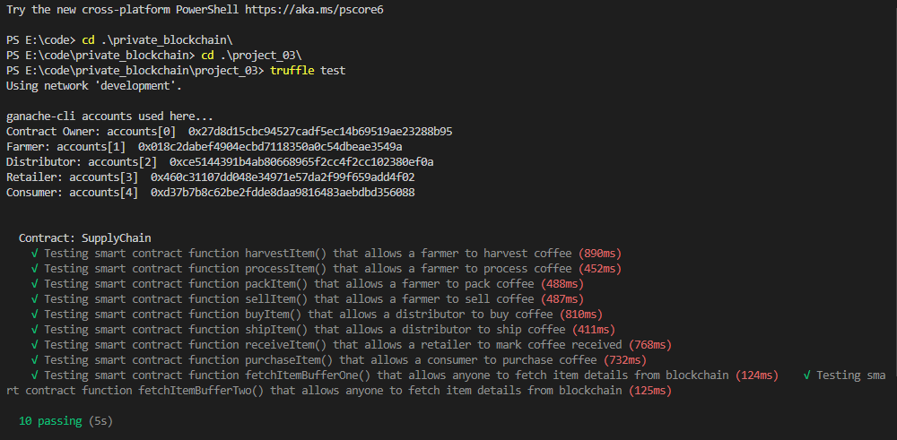

Test smart contracts:

```
truffle test
```

All 10 tests should pass.


In a separate terminal window, launch the DApp:

```
npm run dev
```
Deploy to testnet with rinkeby:
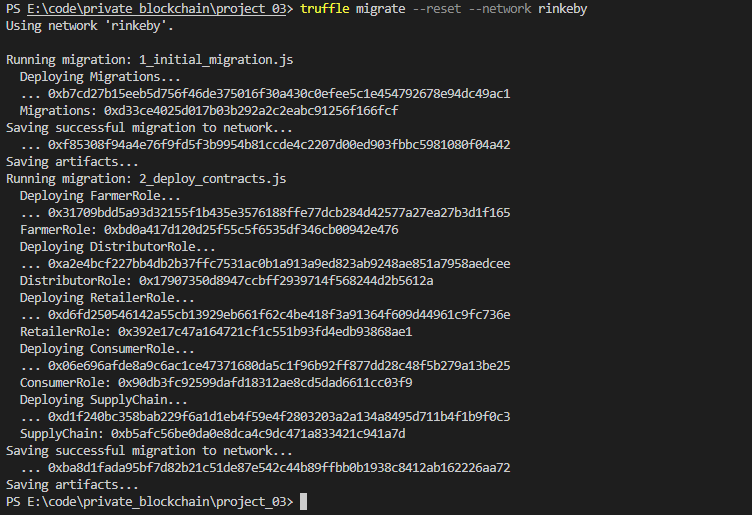

```
Migrations: 0xd33ce4025d017b03b292a2c2eabc91256f166fcf
FarmerRole: 0xbd0a417d120d25f55c5f6535df346cb00942e476
DistributorRole: 0x17907350d8947ccbff2939714f568244d2b5612a
RetailerRole: 0x392e17c47a164721cf1c551b93fd4edb93868ae1
ConsumerRole: 0x90db3fc92599dafd18312ae8cd5dad6611cc03f9
SupplyChain: 0xb5afc56be0da0e8dca4c9dc471a833421c941a7d
```
## RUN DAPP
Run by ganache cli network

Harvest items
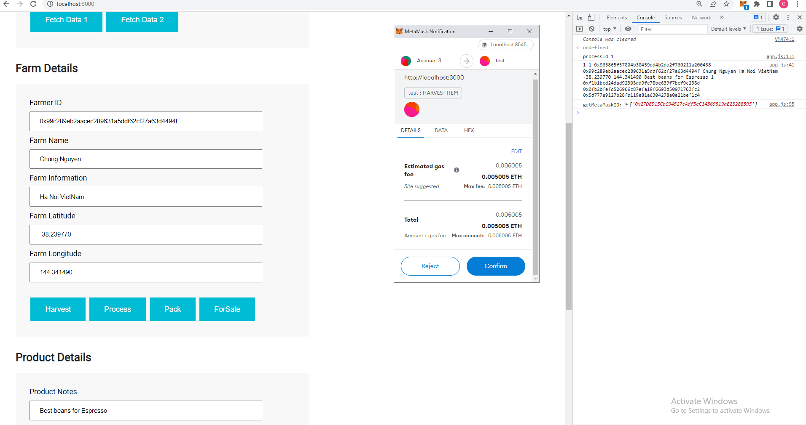
Process items
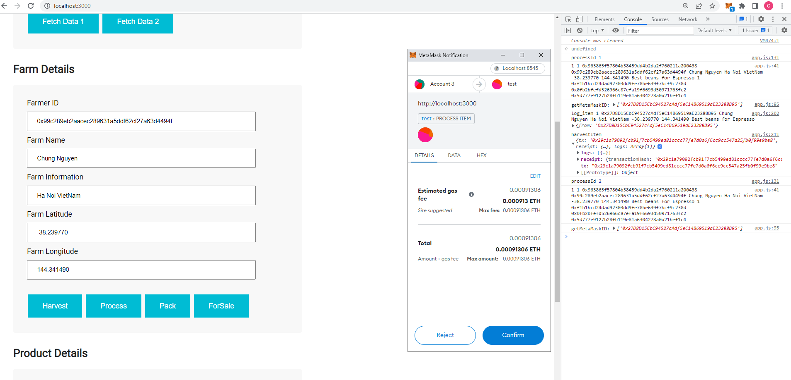
Pack items
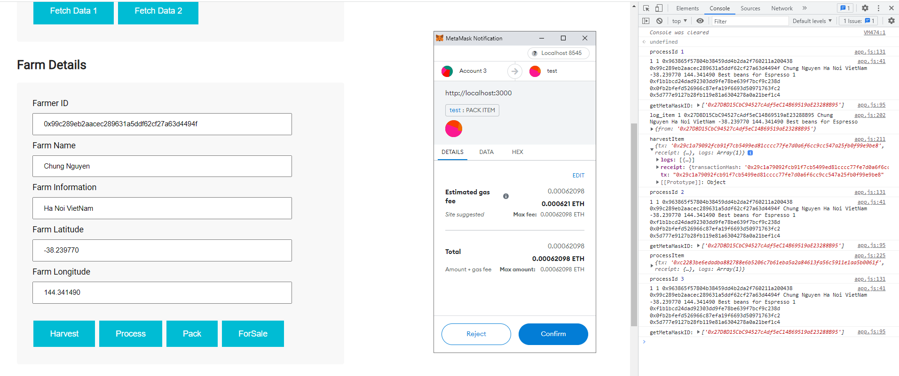
For Sale
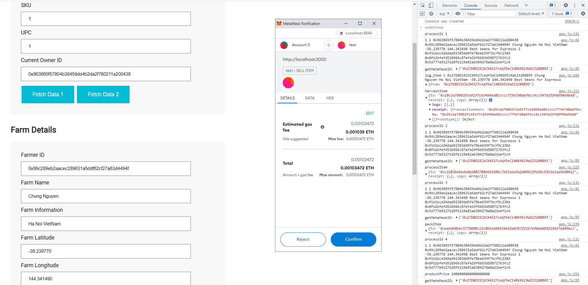
Buy item
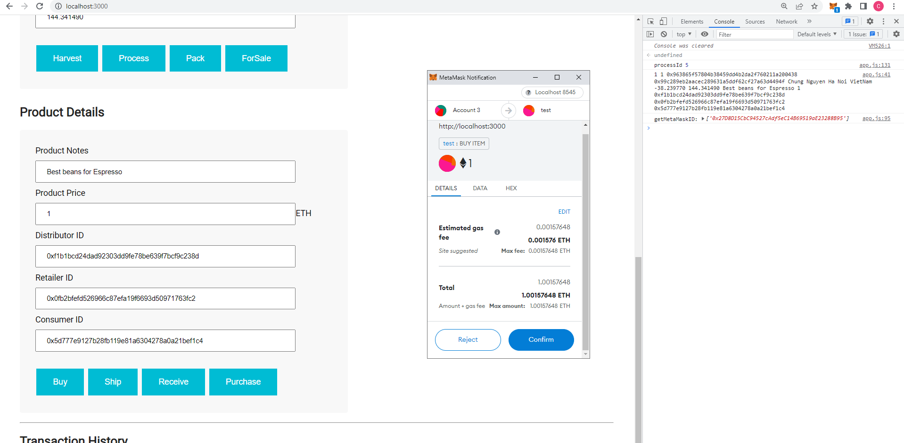
Ship
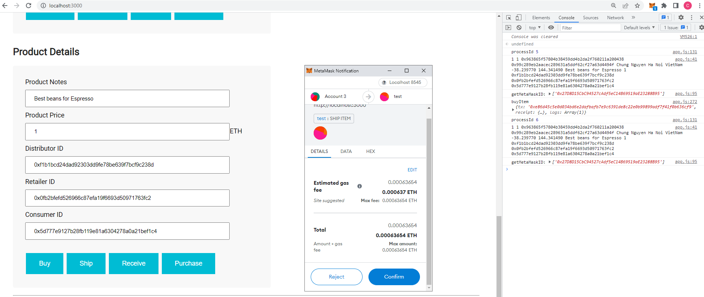
Receive
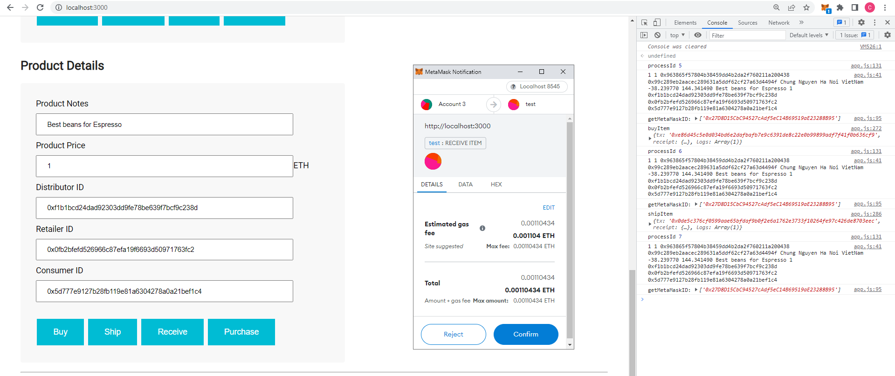
Purchase
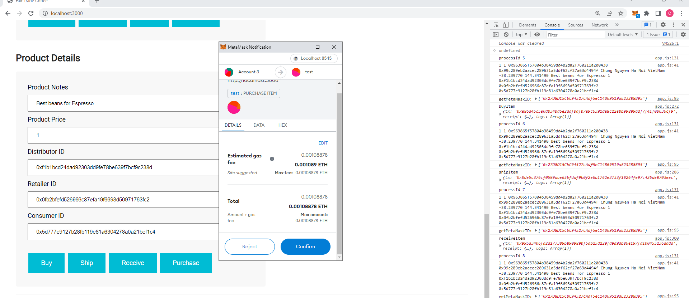
Transaction history:
```
Transaction History
Harvested - 0x29c1a79092fcb91f7cb5499ed81cccc77fe7d0a6f6cc9cc547a25fb0f99e9be8
Processed - 0xc2283be6edadba882788e6b5206c7b61eba5a2a84613fa56c5911e1aa5b0061f
Packed - 0xeebd68bec5776888c15c861bd94534e52a8397f2167e90a0d09219457a489acc
ForSale - 0x8d7aea919d77b97dde9dc975bb6a5d4188e028b2bf036023ed1b81ab48f4a59a
Sold - 0xe86d45c5e0d034bd6e2dafbafb7e9c6391de8c22e0b99899adf7f41f0b636cf9
Shipped - 0x0de5c376cf0599aae65bfdaf9b0f2e6a1762e3733f10264fe97c426de8703eec
Received - 0x995a3406fa2d177309b890989bf5db25d229fd9d9db86e197fd100455236dadd
Purchased - 0x0e197a7f456c8f1a5edd18065932284aa40abc4885b3aec1ab76dfa451fd9f5a
```


## Built With

* [Ethereum](https://www.ethereum.org/) - Ethereum is a decentralized platform that runs smart contracts
* [IPFS](https://ipfs.io/) - IPFS is the Distributed Web | A peer-to-peer hypermedia protocol
to make the web faster, safer, and more open.
* [Truffle Framework](http://truffleframework.com/) - Truffle is the most popular development framework for Ethereum with a mission to make your life a whole lot easier.


## Authors

See also the list of [contributors](https://github.com/your/project/contributors.md) who participated in this project.

## Acknowledgments

* Solidity
* Ganache-cli
* Truffle
* IPFS
