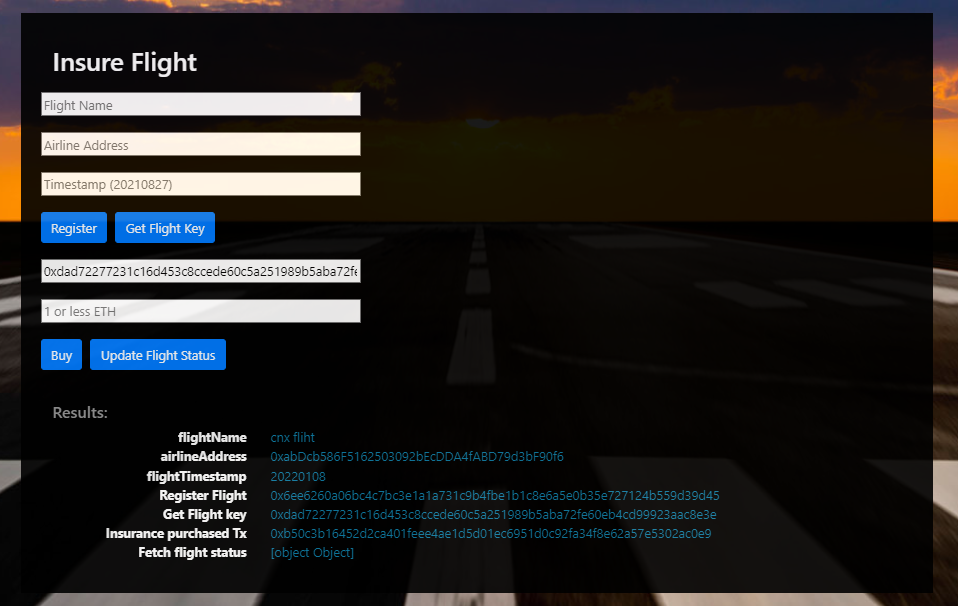

# Fight Surety Dapp
# Installation
Run the next steps to run the application:

Run this command inside the root FlightSurety folder project:
```bash
npm install
```

Compile the smart contracts
```bash
truffle compile
```

Execute ganache-cli with next parameters (This command is required to be executed before run tests or deploy the smart contracts):
```bash
ganache-cli -a 20 -l 9999999 -m "chungnx dep trai nhat pho"   
```

Terminal will show these address:
```text
Available Accounts
==================
(0) 0x476C62D760dc8a143aBcf2b5B6c5ffba1610a823 (100 ETH)
(1) 0xDF02A12abe982b0fCAE403414e26fF7d5f54689c (100 ETH)
(2) 0xabDcb586F5162503092bEcDDA4fABD79d3bF90f6 (100 ETH)
(3) 0x9B94DaD9d89985Fb56668EcA45cc2D7B0B7d7085 (100 ETH)
(4) 0x08610F51aba416DFF49b315CAe636c4F95b98FAA (100 ETH)
(5) 0xF1b29d396d810Ba224B96cea42A0511A41295F7b (100 ETH)
(6) 0x7287713510219d6097e7F74ff2215c8cbEd0eeE7 (100 ETH)
(7) 0x15658845e6865473ebBce6B82f2c24b0D65AF4d3 (100 ETH)
(8) 0xfB7F9e8e700b45f342D2223219e7e2999A858cC2 (100 ETH)
(9) 0xAE1526D037042a8Bef4041Ed23702109EBF88b98 (100 ETH)
(10) 0x23D86d1BA34C541B115784D72d003d0104f914E6 (100 ETH)
(11) 0x95bcd5065eab06B1bd6C0701A859618Ef892c4D5 (100 ETH)
(12) 0x4D21188018EBa1E9F2e159414e8d8166f592861C (100 ETH)
(13) 0x620564e25c4fa065A70Ec50E8e5304451721B0d2 (100 ETH)
(14) 0x7130EDC11D007489e5137DDA1ded4c673754484C (100 ETH)
(15) 0x5495275a5C7047b5F433C75D1A44C387f1b4028E (100 ETH)
(16) 0x5AE780b7504e149f8775851F99490bF754C1E8FD (100 ETH)
(17) 0x76038C27f915AFF322837917E68e80BC4226b511 (100 ETH)
(18) 0xF67602c6BDC909de42b633aFC0C93f2ca7e512F8 (100 ETH)
(19) 0x575DDA996B3706738B8c6cb14e92F3030E85895a (100 ETH)

Private Keys
==================
(0) 0xf28c3454330bc762aef426a2692f660cc9b268d5ca841e094cfdbce630975ead
(1) 0xb0959969ee90154775e2410ff35556c3bf1e3e1200a7141aadb460933d6131f4
(2) 0xfb05c2ff44d3bf28f057672fb695e97b9b9fddfff2757ec27c92de6a9362e16d
(3) 0x76c53c59425f1c60428f4e60d3e03629f93e2f939695be82422558a4e959d677
(4) 0x304bd5aba4abe5311a322b98964e871cf336aa6f8dfcb6224de6b15a6652a3bb
(5) 0x5ad10143ba056c5dec076fe3defb3cc0fd962321e49840ca8803262d666927d5
(6) 0x4de56791b4b49165006225c8428b85d6a04194fc11d9ede864b2fc8f07f5eae3
(7) 0xcfb854e402de0e14a7417c894d4ea524c17ad4167f8683408a6de4abad33d3d0
(8) 0x6265661db7dd970193b33440bdc2f7f83d9bfe07b0d8f944d2dddd0285b8f643
(9) 0xeec67e4c0064e4a5ae29fc4dd0e9237846c43888f803bd65b62ac70167fd34c4
(10) 0x80b825136ab0c328e83340d7690c53311d694462a4c6ed9c97e11ef3cee38835
(11) 0x5521c472cb548034ab2908ae9f84a00cf03369bd7a453efb216d26a98ed346db
(12) 0xfb11ead2a09638ca825c0fe1e6b9d987ba5c66b402839c89c12780533049c7f3
(13) 0xfc0273f3111bd131d1ad7ae49d43cb3a07fba4649082d5ac1633509b91afcede
(14) 0x3e4e8e1f8927f40aea86c4afda7fbb75ec6ef21c428303b40d6845f85d19af15
(15) 0x73d6eba92e8cd2c5d0beb2af8ab652b9fccba25a5aacd296d5b20fb4b6005e02
(16) 0x1d404a7fc2ba00714574cafe682dfebf18df63215e0c64909540a0d82e669206
(17) 0xa40df37a698a881a3a5facaf249bdb4de15cc10dcce604a2d244b69023570da0
(18) 0xd7d16de591c800f91c8be41133bd9d9b578149a8e676b8f1b49fdeac3b69dc27
(19) 0x4a95752887e30e735511a178fbed4cac164307c561a7b255ce32c4871f82b930
```

If you want to run the test cases:
```bash
truffle test
```

The result should be something like this:


To deploy the smart contracts to Ganache you must run in terminal:
```bash
truffle migrate --network development
```

Start the server that register the Oracles and simulates their responses:
```bash
npm run server
```
You should see this results in terminal:

To run the dapp frontend you should run this command:
```bash
npm run dapp
```


At the first we have to fund for owner address:


Register new Airline and fund for new airline:


Register new Flight:


Get flight key to buy insure and updat flight status:


Buy insure and updat flight status:




Check amount refund:


get refund:

