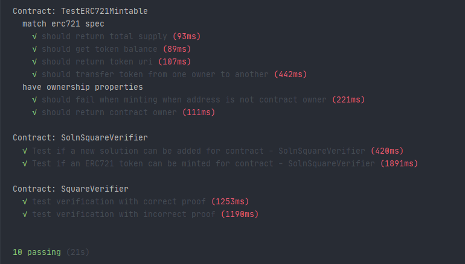
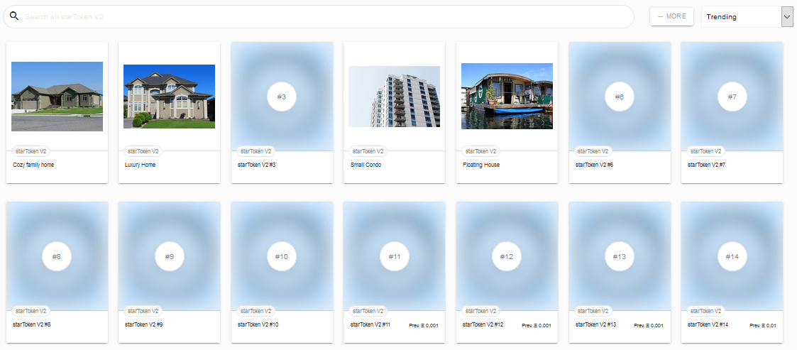

# Capstone: Real Estate Marketplace

The capstone will build upon the knowledge you have gained in the course in order to build a decentralized housing product. 

## Getting Started

In this project you will be minting your own tokens to represent your title to the properties. Before you mint a token, you need to verify you own the property. You will use zk-SNARKs to create a verification system which can prove you have title to the property without revealing that specific information on the property.

### Install

This repository contains Smart Contract code in Solidity (using Truffle) and tests (also using Truffle).

To install, download or clone the repo, then:

```npm install ``` ```truffle  compile ```

## Tests
```
truffle test
```

There are 10 tests, one for each allowed action.

```
it('should fail when minting when address is not contract owner', async function () {
            let exception = false;
            try{
                await this.contract.mint(account_three,5,{from: account_two});
            }catch(e){
                exception = true;
            }
            assert.equal(exception,true,"should fail when minting when address is not contract owner.");
        })
```



Following the example of the Starter Code provided by Udacity at the following [link](https://github.com/udacity/Blockchain-Capstone).

### Info for submit

* Contract Address (SquareVerifier): 0x752D8E5bb7dB542DB82a5eA3A1FE5B82D92B334f
* Contract Address (SolnSquareVerifier): 0x69622e97a30C9Ba4bDAD8e7A8A024201fCF45F03 
* Program version: 1.0.0
* Node version: v12.16.1
* Truffle version: v5.1.19
* web3 version: v1.2.1
* [OpenSea MarketPlace Storefront](https://rinkeby.opensea.io/assets/startoken-v2)



## Versioning

Actual version: 1.0.0

## Authors

* **[Mattia-Code](https://github.com/Mattia-code)**

# Project Resources

* [Ethereum](https://www.ethereum.org/)
* [Remix - Solidity IDE](https://remix.ethereum.org/)
* [Visual Studio Code](https://code.visualstudio.com/)
* [Truffle Framework](https://truffleframework.com/)
* [Ganache - One Click Blockchain](https://truffleframework.com/ganache)
* [Open Zeppelin ](https://openzeppelin.org/)
* [Interactive zero knowledge 3-colorability demonstration](http://web.mit.edu/~ezyang/Public/graph/svg.html)
* [Docker](https://docs.docker.com/install/)
* [ZoKrates](https://github.com/Zokrates/ZoKrates)

### Note

```
truffle migrate --reset --network rinkeby
```

