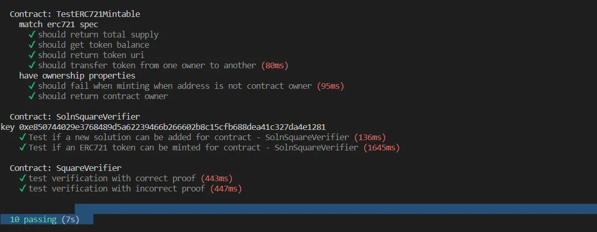
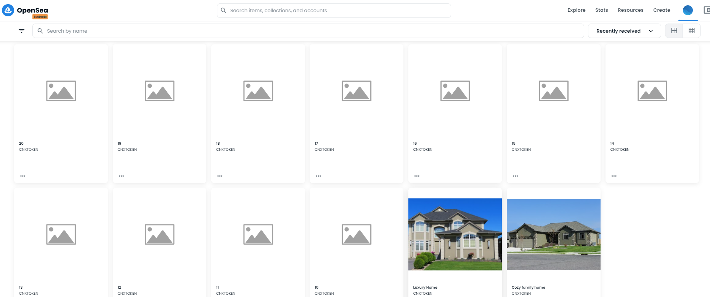

# Capstone: Real Estate Marketplace

The capstone will build upon the knowledge you have gained in the course in order to build a decentralized housing product. 

## Getting Started

In this project you will be minting your own tokens to represent your title to the properties. Before you mint a token, you need to verify you own the property. You will use zk-SNARKs to create a verification system which can prove you have title to the property without revealing that specific information on the property.

### Install

This repository contains Smart Contract code in Solidity (using Truffle) and tests (also using Truffle).

To install, download or clone the repo, then:

```
npm install
cd eth-contracts
truffle  compile
 ```

## Tests
```
truffle test
```

There are 10 tests, one for each allowed action.




## Deploy rinkeby
run command:
```
truffle migrate --reset --network rinkeby
```
result:

 ```
 2_deploy_contracts.js
=====================

   Deploying 'SquareVerifier'
   --------------------------
   > transaction hash:    0xae11982833ae1eadf82c3258c22ec80148ce1c3e53095571144895f34c2a6619
   > Blocks: 1            Seconds: 10
   > contract address:    0x86ef3a647467C9A4B4dC4C0bD4c20174a07E9974
   > block number:        11248001
   > block timestamp:     1661185810
   > account:             0xC5aCEF32d1324985290f58ACF263F8909778E592
   > balance:             2.909741750499223896
   > gas used:            992659 (0xf2593)
   > gas price:           10 gwei
   > value sent:          0 ETH
   > total cost:          0.00992659 ETH


   Deploying 'SolnSquareVerifier'
   ------------------------------
   > transaction hash:    0xc871ac185eead2ada2d35cb9938653d25111348c8fab8cc1ad32d0a08c947447
   > Blocks: 2            Seconds: 21
   > contract address:    0xc1b69249a80D9EA71EC2221C2812EAD6B9dc6014
   > block number:        11248003
   > block timestamp:     1661185840
   > account:             0xC5aCEF32d1324985290f58ACF263F8909778E592
   > balance:             2.865651560499223896
   > gas used:            4409019 (0x4346bb)
   > gas price:           10 gwei
   > value sent:          0 ETH
   > total cost:          0.04409019 ETH

   > Saving migration to chain.
   > Saving artifacts
   -------------------------------------
   > Total cost:          0.05401678 ETH

Summary
=======
> Total deployments:   3
> Final cost:          0.05628215 ETH
### Info for submit
 ```

* Contract Address (SquareVerifier): 0x86ef3a647467C9A4B4dC4C0bD4c20174a07E9974
* Contract Address (SolnSquareVerifier): 0xc1b69249a80D9EA71EC2221C2812EAD6B9dc6014
* [Link deployment transaction](https://rinkeby.etherscan.io/address/0xC5aCEF32d1324985290f58ACF263F8909778E592)

## Mint Token
[Tool myetherwallet](https://www.myetherwallet.com)

setup mint:


mint token:


mint success:


[link check mint transactions](https://rinkeby.etherscan.io/address/0xc1b69249a80D9EA71EC2221C2812EAD6B9dc6014)

## Opensea listing:
Listing NFT to opensea tesnet


[link check mint Opensea NFT](https://testnets.opensea.io/collection/cnxtoken)

sell items:


purchase items:


* [Ethereum](https://www.ethereum.org/)
* [Remix - Solidity IDE](https://remix.ethereum.org/)
* [Visual Studio Code](https://code.visualstudio.com/)
* [Truffle Framework](https://truffleframework.com/)
* [Ganache - One Click Blockchain](https://truffleframework.com/ganache)
* [Open Zeppelin ](https://openzeppelin.org/)
* [Interactive zero knowledge 3-colorability demonstration](http://web.mit.edu/~ezyang/Public/graph/svg.html)
* [Docker](https://docs.docker.com/install/)
* [ZoKrates](https://github.com/Zokrates/ZoKrates)

### Note


